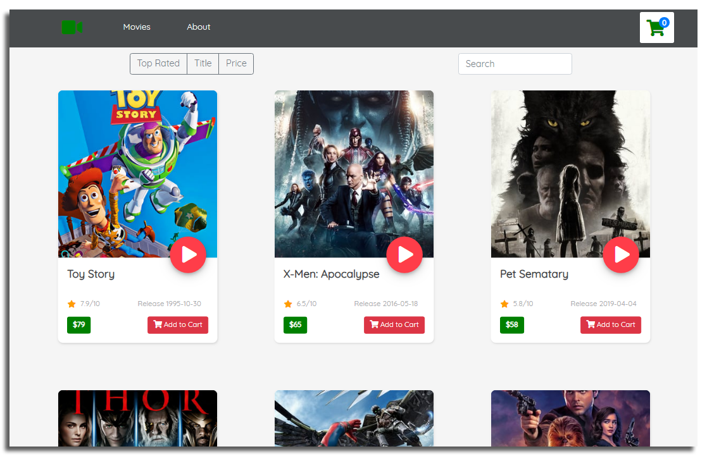
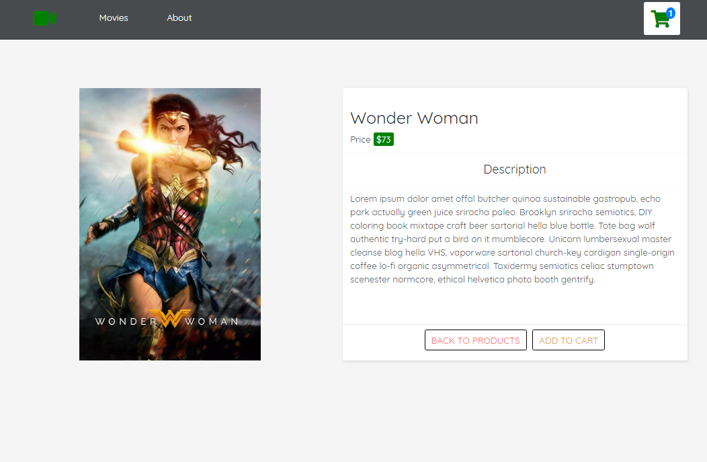
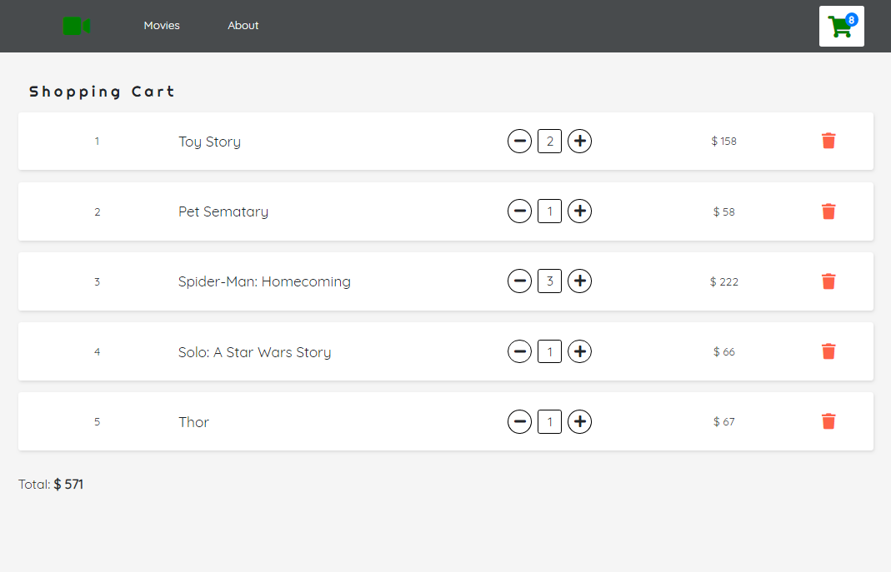

# E-commerce Shopping Cart Application
This is a simple ecommerce movies store application built with React, Redux and React Router.

<b>LIVE:</b> https://maksymchak.github.io/movies-store/





## Running
```bash
git clone https://github.com/maksymchak/movies-store.git
npm install
npm start
```
Runs the app in the development mode.  
Open [http://localhost:3000](http://localhost:3000/) to view it in the browser.



## Folder Structure
After creation, your project should look like this:
```
movies-store/
  README.md
  .gitignore
  package.json
  package-lock.json
  assets/
  node_modules/
  public/
    index.html
    favicon.ico
  src/
    index.js
    store.js
    services/
        moviestore-service.js
    reducers/
        index.js
        movielist.js
        shoppingcart.js
    actions/
        index.js
    components/
        app/
        app-header/
        card/
        cart-item/
        error-boundry/
        error-indicator/
        filter-panel/
        hoc/
        moviestore-service-context/
        pages/
        spinner/
```
## Builds
```bash
npm run build`
```
Builds the app for production to the `build` folder.
It correctly bundles React in production mode and optimizes the build for the best performance.
The build is minified and the filenames include the hashes.
Your app is ready to be deployed!

## Misc
Follow Me: [LinkedIn](https://www.linkedin.com/in/anton-maksymchak/), [Facebook](https://www.facebook.com/Anton.Maksymchak), [GitHub](https://github.com/maksymchak)                                                                                                                                                                                         
                                                                
©[Anton Maksymchak](https://github.com/maksymchak) 2019
